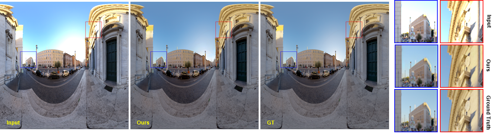

# LGITM
This is the official repo of paper \
[Local-Global Information Integration En-decoder with Tone Mapping Loss for Inverse Tone Mapping]().

## Introduction


## Get Started
### Prerequisites
- Python 3.6+
- Nvidia GPU + CUDA, CuDNN
- Tensorflow

### Installation
First use the following commands to prepare the conda environment:

```bash
conda create -n LGITM python=3.6
source activate LGITM
pip install -r requirements.txt
```

### Test
coming soon!

### Train
coming soon!

## Comparison with State-of-the-Arts

- On synthesis data
<figure>

</figure>

- On real data
<figure>

</figure>

- On HDRSID dataset
<figure>

</figure>

